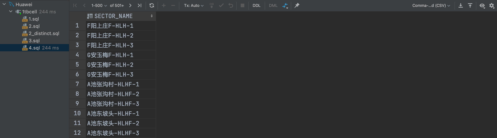
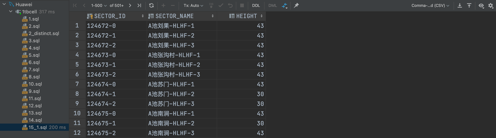
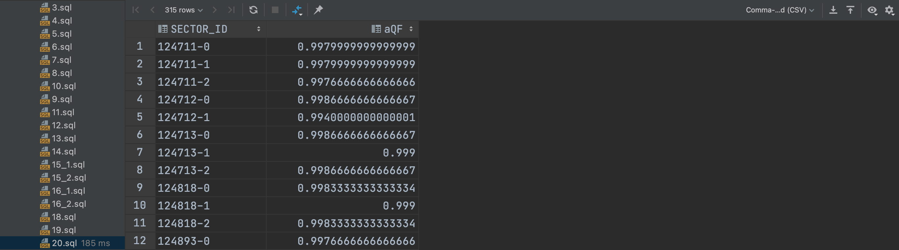
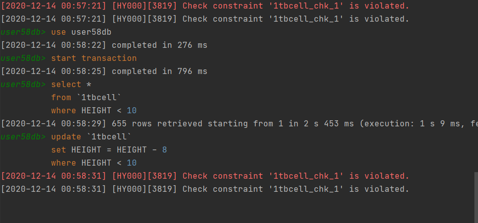
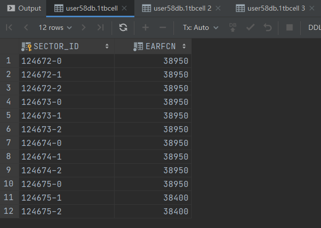
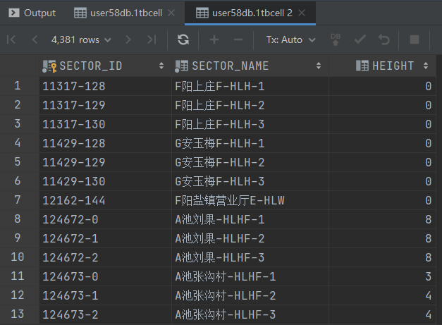
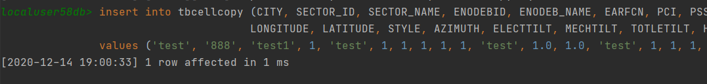

 	#  数据库系统实验报告

[TOC]

## 实验环境

* Windows 10 Pro 2004、macOS 11.0
* MySQL Workbench、DataGrip 2020.3
* 采用GaussDB(MySQL)/openGaussDB数据库管理系统作为实验平台

## 数据库连接

### 实验目的

* 掌握DAS连接GaussDB(for MySQL)数据库实例。

### 实验内容

* 通过华为云数据管理服务 (Data Admin Service，简称DAS) ，通过预先分配好的 IAM 子账号，来连接华为云 GaussDB(for MySQL) 数据库实例。
* 通过 DataGrip 公网连接 GaussDB(for MySQL) 数据库实例。
* 向服务器导入本地数据表。
* 修正数据类型。

### 实验步骤

1. 登录数据库
2. 导入数据表
3. 修正数据类型

* 实验过程略，仅展示结果。


## 数据查询与修改

### 实验目的

* 对前两个实验建立的LTE数据库关系表和视图进行各种类型的查询操作和修改操作，加深对SQL语言中DML的了解，掌握相关查询语句和数据修改语句的使用方法。

### 实验内容

1. 单表简单查询，包括复合选择条件、结果排序、结果去重、结果重命名查询；
2. 多表查询，包括等值连接、自然连接、元组变量查询；
3. 统计查询，包括带有分组、聚集函数的查询；
4. 嵌套查询，包括带有 in/some/all、exists、unique 的嵌套查询，from 中子查询；
5. with 临时视图查询；
6. 键/函数依赖分析；
7. 表的插入、删除、更新

### 实验步骤

#### 单表查询

##### 查询1

从小区/基站信息表tbCell表中，找出“sanxia”市满足下列条件的所有小区cell：

（1）所属基站的经纬度范围分别位于[？,？]、[？,？？]，并且

（2）PCI值在？至？之间，并且

（3）设备厂家VENDOR不为空

列出这些小区的小区标识（Sector_ID）、小区名、所属基站的基站ID和基站名、基站经纬度、小区PCI、小区天线的方位角(azimuth)和高度(height)；

要求：对查询结果，按照经度范围从大到小、纬度范围从大到小、频点(RARFCN)从高到低排序，并且将PCI重新命名为Physical Cell Identity。

说明：？代表由学生自己选择输入条件

----

```mysql
SELECT ENODEBID, ENODEB_NAME, LONGITUDE, LATITUDE, PCI as "Physical Cell Identity", AZIMUTH, HEIGHT
FROM user58db.`1tbcell`
WHERE LONGITUDE BETWEEN 100 AND 120
  AND CITY = "sanxia"
  AND LATITUDE BETWEEN 20 AND 40
  AND PCI BETWEEN 0 AND 200
  AND VENDOR is not null
ORDER BY LONGITUDE DESC, LATITUDE DESC, EARFCN DESC;
```


##### 查询2：

从小区/基站信息表tbCell表中，找出“sanxia”市满足下列条件的所有基站ENodeB：

（1）所属基站的经纬度范围分别位于[？-？]、[？,？？]，

（2）属于该基站的小区中，至少有一个小区的PCI值在？至？之间

列出这些基站的基站ID和基站名、基站经纬度、基站类型(Style)、设备生产厂家(Vendor)；要求：对查询结果，按照基站位置从北到南、从东到西排序，并且对查询结果使用distinct去重。

比较对查询结果去重和不去重，在查询时间和查询结果上的差异。

----

* 不去重：

```mysql
SELECT ENODEBID, ENODEB_NAME, LONGITUDE, LATITUDE, STYLE, VENDOR
FROM user58db.`1tbcell`
WHERE LONGITUDE BETWEEN 100 AND 120
  AND CITY = "sanxia"
ORDER BY LONGITUDE DESC, LATITUDE DESC;
```


* 去重：

```mysql
SELECT distinct ENODEBID, ENODEB_NAME, LONGITUDE, LATITUDE, STYLE, VENDOR
FROM user58db.`1tbcell`
WHERE LONGITUDE BETWEEN 100 AND 120
  AND CITY = "sanxia"
ORDER BY LONGITUDE DESC, LATITUDE DESC;
```


* 进行去重查询，花费时间略长于不去重。


#### String 操作

##### 查询3：

从小区/基站信息表tbCell表中，找出满足下列条件的小区：

（1）小区名开头部分包含“A池”或“高铁”，或者基站名中包含“医院”或“实验高中”，并且

（2） 不是所属基站的第1小区，即小区名结尾部分不是“-1”

----

```mysql
SELECT SECTOR_NAME
FROM user58db.`1tbcell`
WHERE (SECTOR_NAME LIKE "A池%"
    OR SECTOR_NAME LIKE "高铁%"
    OR SECTOR_NAME LIKE "%医院%"
    OR SECTOR_NAME LIKE "%实验高中%")
  AND NOT SECTOR_NAME LIKE "%-1";
```


##### 查询4：

从小区/基站信息表tbCell表中，找出满足下列条件的小区：

（1）小区标识由5个字符组成，并且

（2）小区所属基站的名字/标识至少包括8个字符，即名字字符串的长度不小于8。

----

```mysql
SELECT SECTOR_NAME
FROM user58db.`1tbcell`
WHERE SECTOR_NAME LIKE "_____-%-%"
  AND ENODEB_NAME LIKE "____%____";
```



 

#### 集合操作

##### 查询5：

使用集合并操作union、union all，从小区KPI指标表tbCellKPI查询满足下列条件的小区

(1)小区RRC建立成功率qf (%)大于95%，或者

(2)E-RAB建立成功率2 (%)大于99%

对比union all、union操作在查询结果、执行时间上的差异。

----

```mysql
(SELECT SECTOR, SECTOR_NAME
 FROM user58db.`12tbcellkpi`
 WHERE QF > 0.95)
UNION ALL
(SELECT SECTOR, SECTOR_NAME
 FROM user58db.`12tbcellkpi`
 WHERE ERABf > 0.99)
```


##### 查询6：

结合教材3.4.1节元组变量样例，使用集合操作except、except all，从小区/基站信息表tbCell表中，查询位于最北端（具有最大纬度）的基站。

对比使用except、except all、聚集函数max，完成此查询在执行时间、查询结果上的异同。

----

```mysql
SELECT ENODEBID, ENODEB_NAME
FROM user58db.`1tbcell`
WHERE LATITUDE in (
    SELECT MAX(LATITUDE) as LATITUDE
    FROM user58db.`1tbcell`
);
```


#### 多表查询

##### 查询7：

选取两张数据量比较大的表T1和T2，如tbMROData、tbCellTraffic、tbC2I、tbHandover，执行如下无连接条件的笛卡尔积操作，观察数据库系统的反应和查询结果：

  Select * from T1, T2

----

```mysql
use user58db;
SELECT *
FROM `9tbmrodata`,
     `6tbatudata`;
```


##### 查询8：

使用多表连接操作（3.3.3 join/natual join，4.1.1 join），从小区/基站信息表tbCell表、小区一阶邻区关系表tbAdjCell、小区二阶（同频）邻区关系表tbSecAdjCell中，查询有相同的一阶邻小区和二阶邻小区的主小区，列出这些主小区的小区标识、小区名称、小区频点，以及该小区的一阶邻小区和二阶邻小区的小区标识及其频点。

----

```mysql
select *
from user58db.`2tbadjcell` as a
         inner join user58db.`3tbsecadjcel` as b
                    on a.S_SECTOR_ID = b.S_SECTOR_ID and a.N_SECTOR_ID = b.N_SECTOR_ID;
```


 

##### 查询9：

使用多表连接操作，从小区/基站信息表tbCell表、路测ATU C2I干扰矩阵表tbATUC2I、路测ATU切换统计矩阵表tbATUHandover中，查询小区标识ID为“238397-1”的主小区的同站干扰小区的小区和切换目标小区，列出主小区名称和ID、同站干扰小区的ID、切换目标小区的ID。

----

```mysql
SELECT *
FROM (
         select A.SECTOR_ID,
                C.SECTOR_NAME,
                A.NCELL_ID,
                B.NSECTOR_ID
         FROM user58db.`7tbatuc2i` AS A
                  INNER JOIN user58db.`8tbatuhandover` AS B
                  INNER JOIN user58db.`1tbcell` AS C
                             ON A.SECTOR_ID = B.NSECTOR_ID AND A.SECTOR_ID = C.SECTOR_ID
         WHERE A.SECTOR_ID = "238397-1"
           and COSITE = 1
     ) AS TMP;
```


##### 查询10：

利用MR测量报告干扰分析表tbC2I表，使用教材3.4.1节元组变量as/rename方式，查询所有比主小区ID为“124673-0”，邻小区ID为“259772-0”的小区间C2I干扰均值高的主小区、邻小区，列出这些主邻小区的名称、ID和C2I干扰值，结果按照C2I干扰均值的降序排列。

----

```mysql
SELECT B.SCELL, C.SECTOR_NAME AS SS_NAME, B.NCELL, D.SECTOR_NAME AS NS_NAME
FROM user58db.`10tbc2i` AS A,
     user58db.`10tbc2i` AS B,
     user58db.`1tbcell` AS C,
     user58db.`1tbcell` AS D
WHERE A.SCELL = "124673-0"
  AND A.NCELL = "259772-0"
  AND A.C2I_Mean < B.C2I_Mean
  AND C.SECTOR_ID = B.SCELL
  AND D.SECTOR_ID = B.NCELL
ORDER BY B.C2I_Mean DESC;
```


#### 聚集函数

##### 查询11：

从小区小时级话务量表tbCellTraffic、从小区/基站信息表tbCell表，查询2020年5月期间，每天忙时时段（包括早9点-11点2个小时、晚19点-21点，共4个小时）的位于经度范围[？,?]、纬度范围[?,?]内的

（1）全部小区的最大月忙时话务量、最小月忙时话务量、平均月忙时话务量;

（2）具有最大月忙时话务量的小区，列出该小区ID、名称、经纬度位置，以及月忙时话务量。

月忙时话务量=月内各天的忙时话务量累加

----

```mysql
-- 最大值得相关信息
with t as (SELECT sum(A.Traffic) as s, A.Sector_ID, B.SECTOR_NAME, B.LONGITUDE, B.LATITUDE
           FROM user58db.`tbcell_traffic` AS A
                    INNER JOIN user58db.`1tbcell` AS B ON A.Sector_ID = B.SECTOR_ID
           WHERE (
               A.Hour BETWEEN 9 AND 11 OR A.Hour BETWEEN 19 AND 21
               )
             AND B.LATITUDE BETWEEN -90
               AND 90
             AND B.LONGITUDE BETWEEN 0
               AND 120
             AND str_to_date(A.Date, "%m/%d/%Y %H:%i:%s") BETWEEN str_to_date("05/01/2020", "%m/%d/%Y %H:%i:%s")
               AND str_to_date("5/31/2020", "%m/%d/%Y %H:%i:%s")
           GROUP BY A.SECTOR_ID)
select max(s) as MAX, t.Sector_ID, t.SECTOR_NAME, t.LATITUDE, t.LONGITUDE
from t
WHERE s = (SELECT MAX(t.s) from t);

-- 最大最小平均
with t as (SELECT sum(A.Traffic) as s, A.Sector_ID, B.SECTOR_NAME, B.LONGITUDE, B.LATITUDE
           FROM user58db.`tbcell_traffic` AS A
                    INNER JOIN user58db.`1tbcell` AS B ON A.Sector_ID = B.SECTOR_ID
           WHERE (
               A.Hour BETWEEN 9 AND 11 OR A.Hour BETWEEN 19 AND 21
               )
             AND B.LATITUDE BETWEEN -90
               AND 90
             AND B.LONGITUDE BETWEEN 0
               AND 120
             AND str_to_date(A.Date, "%m/%d/%Y %H:%i:%s") BETWEEN str_to_date("05/01/2020", "%m/%d/%Y %H:%i:%s")
               AND str_to_date("5/31/2020", "%m/%d/%Y %H:%i:%s")
           GROUP BY A.SECTOR_ID)
SELECT MAX(t.s), MIN(t.s), AVG(t.s)
from t;
```


##### 查询12：

根据优化小区/保护带小区表tbOptCell和小区一阶邻区关系表tbAdjCell，查询一阶邻区数大于10的优化小区，给出这些优化小区的标识、名称，以及邻区数量，并将查询结果按照邻区数目降序排列。

----

```mysql
SELECT A.SECTOR_ID, C.SECTOR_NAME, COUNT(B.N_SECTOR_ID) AS CNT
FROM user58db.`4tboptcell` AS A
         JOIN user58db.`2tbadjcell` AS B
         JOIN user58db.`1tbcell` AS C
              ON A.SECTOR_ID = B.S_SECTOR_ID AND A.SECTOR_ID = C.SECTOR_ID
WHERE A.CELL_TYPE = "优化区"
GROUP BY A.SECTOR_ID
HAVING COUNT(B.N_SECTOR_ID) > 10
ORDER BY CNT DESC;
```


##### 查询13：

从小区话务量表tbCellTraffic、小区/基站信息表tbCell表中，查询所有包含38400频点的基站的年平均小时级话务量avgTraffic，给出年平均话务量超出avgTraffic的基站ID名称、基站年平均话务量，结果按照年平均话务量降序排列。

注：1个基站ENodeB有1~3个38400频点小区。

----

```mysql
use user58db;
select avg(a.Traffic) as average, a.Sector_ID
from tbcell_traffic as a
         inner join `1tbcell` as b on a.Sector_ID = b.SECTOR_ID
group by year(str_to_date(a.Date, "%m/%d/%Y %H:%i:%s")), a.Sector_ID
having average > (select avg(a.Traffic)
                  from tbcell_traffic as a
                           inner join `1tbcell` as b on a.Sector_ID = b.SECTOR_ID
                  where b.EARFCN = 38400)
order by average DESC;
```


#### 嵌套查询

##### 查询14：

从小区/基站信息表tbCell、优化小区/保护带小区tbOptCell和小区PCI优化调整结果表tbPCIAssignment中，使用set membership运算符in，查询小区类型为“优化区”的小区、PCI调整前后没有发生变化的小区，列出这些优化小区的ID和名称、调整前后的PCI。

对比使用多表连接、非嵌套的查询在执行时间、查询结果上的异同。

----

```mysql
use user58db;
select `1tbcell`.SECTOR_ID, `1tbcell`.SECTOR_NAME, `1tbcell`.PCI, `5tbpciassignment`.PCI
from `1tbcell`,
     `4tboptcell`,
     `5tbpciassignment`
where `1tbcell`.SECTOR_ID = `5tbpciassignment`.SECTOR_ID
  and `1tbcell`.PCI = `5tbpciassignment`.PCI;
```


##### 查询15-1：

从小区/基站信息表tbCell，使用Set Comparison 运算符some，查询满足下列条件的小区：该小区的天线高度height高于位于经度在[?,?]、纬度在[?,?]区域内的部分（至少一个）小区的天线高度，列出这些小区的名称、标识和天线高度。

----

```mysql
use user58db;
select SECTOR_ID, SECTOR_NAME, HEIGHT
from `1tbcell`
where HEIGHT > some (select HEIGHT
                     from `1tbcell`
                     where 111 <= LONGITUDE <= 112
                       and 33.2 <= LATITUDE <= 33.6)
```




##### 查询15-2：

从路测ATU数据表tbATUdata，使用Set Comparison 运算符some，查询满足下列条件的小区：在路测数据中作为主小区/服务小区CELLID，其参考信号接收功率RSRP，大于部分（基站标识ENodeBID=253903的小区作为主小区/服务小区时的参考信号接收功率RSRP。列出这些小区的ID、名称、在测量报告中作为主服务小区的RSRP。

----

```mysql
use user58db;
select CellID, RSRP
from `6tbatudata`
where RSRP > some (select RSRP
                   from `6tbatudata`
                   where CellID in (select SECTOR_ID
                                    from `5tbpciassignment`
                                    where ENODEB_ID = 253903));
```


##### 查询16-1：

从小区小时级话务量表tbCellTraffic中，使用Set Comparison 运算符>=all，查询全年小时级话务量总和满足下列条件的小区：该小区的全年话务量总和大于等于其它小区的全年话务量总和，即该小区的全年话务量总和最高。

----

```mysql
use user58db;
select Sector_ID
from tbcell_traffic
group by Sector_ID
having sum(Traffic) >= all (select sum(Traffic)
                            from tbcell_traffic
                            group by Sector_ID)
```


##### 查询16-2：

切换统计表tbHandOver，使用Set Comparison 运算符all，查询作为源小区SCELL与周边目标/邻小区NCELL发生切换次数(HOATT)最多的小区。列出这些源小区的ID、目标/邻小区ID、发生的切换次数。

----

```mysql
use user58db;
select SCELL, NCELL, HOATT
from `11tbhandover`
group by SCELL
having max(HOATT);
/*
where HOATT >= all (select HOATT
                    from `11tbhandover`);*/
```


##### 查询17-1：

从切换统计表tbHandOver表，使用Test for Empty Relations运算符“not exists”，查询作为源小区SCELL，其切换邻小区NCELL包含了{15290-128, 259595-1, 124711-0, 47444-1}中的全部四个小区。

----

```mysql
# mysql doesn't have not exists clause!

use user58db;
select SCELL, NCELL
from `11tbhandover`
where NCELL not in (select NCELL
                    from `11tbhandover`
                    where NCELL in ('15290-128', '259595-1', '124711-0', '47444-1'))
```


##### 查询17-2：

从一阶邻区表tbAdjCell、二阶邻区表tbSecAdjCell中，使用Test for Empty Relations 运算符“not exists”，查询满足下列条件的源小区S_SECTOR_ID：该小区的一阶邻小区包含其全部二阶邻小区，或者该小区的二阶邻小区包含其全部一阶邻小区。

----

 ```mysql
# mysql doesn't have not exists clause!

use user58db;
SELECT DISTINCT a.S_SECTOR_ID
FROM `2tbadjcell` AS a
WHERE NOT EXISTS (
  SELECT DISTINCT s.S_SECTOR_ID
  FROM `2tbadjcell` AS s
  WHERE s.S_SECTOR_ID = a.S_SECTOR_ID AND s.N_SECTOR_ID NOT IN (
    SELECT DISTINCT d.N_SECTOR_ID
    FROM `2tbadjcell` AS d
    WHERE d.S_SECTOR_ID = a.S_SECTOR_ID )) OR
NOT EXISTS (
  SELECT DISTINCT j.S_SECTOR_ID
  FROM `3tbsecadjcel` AS j
  WHERE j.S_SECTOR_ID = a.S_SECTOR_ID AND j.N_SECTOR_ID NOT IN (
    SELECT DISTINCT e.N_SECTOR_ID
    FROM `2tbadjcell` AS e
    WHERE e.S_SECTOR_ID = a.S_SECTOR_ID ))
 ```


###### 查询18：

从小区/基站信息表tbCell、一阶邻区表tbAdjCell中，使用Test for Absence of Duplicate Tuples运算符not unique，查询满足下列条件的源小区：ENodeBID=15114的基站下有多个小区，该源小区至少是基站15114下2个小区的邻小区。

----

 ```mysql
# mysql doesn't have not unique clause!

use user58db;
select all SECTOR_ID
from `1tbcell`,
     `2tbadjcell`
where S_SECTOR_ID in (
    select SECTOR_ID
    from `1tbcell`
    where ENODEBID = 15114
)
  and N_SECTOR_ID = SECTOR_ID
group by SECTOR_ID
having count(SECTOR_ID) >= 2;
 ```


##### 查询19：

从小区KPI性能表tbCellKPI中，使用Subqueries in the From Clause方法，查询满足下列条件的小区：小区在2020/07/17-2020/0719这三天的平均RRC建立成功率大于0.992，给出这些小区的ID和其三天平均连接成功率。

----

```mysql
use user58db;
select SECTOR_ID, aQF
from (select SECTOR_NAME, avg(QF) as aQF
      from `12tbcellkpi`
      group by SECTOR_NAME) as SNaQ,
     `1tbcell`
where aQF > 0.992
  and `1tbcell`.SECTOR_NAME = SNaQ.SECTOR_NAME;
```


#### with临时视图查询

##### 查询20：

用with临时视图方式，实现查询19中查询要求。

----

```mysql
use user58db;
with avgQF(aQF, aNAME) as (select avg(QF), SECTOR_NAME
                           from `12tbcellkpi`
                           group by SECTOR_NAME)
select SECTOR_ID, avgQF.aQF
from `1tbcell`,
     avgQF
where avgQF.aQF > 0.992
  and `1tbcell`.SECTOR_NAME = avgQF.aNAME;
```




##### 查询21：

从小区/基站信息表tbCell、一阶邻区表tbAdjCell中，用with临时视图方式，查询一阶邻小区最多的主小区，给出这些主小区的ID、邻小区数目。

----

```mysql
use user58db;
with cSEC(SID, _count) as (select S_SECTOR_ID, count(N_SECTOR_ID)
                           from `2tbadjcell`
                           group by S_SECTOR_ID)
select SID, max(_count)
from cSEC,
     `1tbcell`;
```


#### 键/函数依赖分析 

##### 查询22：

在MRO测量报告数据表tbMROData中，检查TimeStamp、ServingSector、InterferingSector是否组成超键。

----

```mysql
use user58db;
select count(*)
from `9tbmrodata`
group by TimeStamp, ServingSector, InterferingSector;
```


* count 不全等于一，不组成超键。


##### 查询23：

在PCI优化分配表tbPCIAssignment中，利用SQL语句检查函数依赖ENODEB_ID$\rightarrow$PCI是否成立；如果不成立，利用SQL语句找出导致函数依赖不成立的元组。

----

```mysql
use user58db;
select *
from `5tbpciassignment`
group by ENODEB_ID, PCI
having count(*) > 1
```


* 成立。


#### 关系表的插入/删除/更新

##### 查询24：

向小区一阶邻区关系表中插入一条邻区数据；

----

```mysql
INSERT INTO user58db.`2tbadjcell`
VALUES (124673 - 0, 5691 - 128, 38400, 38400);
```


##### 查询25：

将小区124673-0的全部二阶邻小区，作为该小区的一阶邻小区，加入到一阶邻区表tbAdjCell中。

----

```mysql
INSERT INTO user58db.`2tbadjcell`
SELECT B.S_SECTOR_ID, B.N_SECTOR_ID, NULL, NULL
FROM user58db.`3tbsecadjcel` AS B
WHERE B.S_SECTOR_ID = "124673-0";
```


##### 查询26：

在小区切换统计性能表tbHandover中，删除切换次数最少的那些切换数据。

----

```mysql
# select *
# from user58db.`11tbhandover`
# order by HOATT asc;
#
# insert into user58db.`11tbhandover`
# values ("h","h","h",0,0,0);

delete
from user58db.`11tbhandover`
where HOATT = (select min(HOATT) from (select * from user58db.`11tbhandover`) as x);
```


##### 查询27：

用小区PCI优化调整结果表tbPCIAssignmeng给出的各个小区的优化调整后的PCI值，替换小区/基站消息表tbCell中对应小区的物理小区标识PCI。

----

```mysql
update user58db.`1tbcell` AS a, user58db.`5tbpciassignment` as b
set a.PCI = b.PCI
where a.SECTOR_ID = b.SECTOR_ID;
```


##### 查询28：

针对路测ATU干扰矩阵表tbATUC2I，使用update/case语句做出如下修改：对主小区SECTOR_ID=238397-1，如果该小区与干扰小区N_SECTOR_ID为同站小区(cosite=1)且干扰强度排序rank不小于1，则干扰强度排序减1；如果主小区与干扰小区不同站，干扰强度排序加1。

----

```mysql
update user58db.`7tbatuc2i`
set RATIO_ALL = case
                    when (`RANK` >= 1 and COSITE = 1) then RATIO_ALL - 1
                    when COSITE != 1 then RATIO_ALL + 1
                    else RATIO_ALL
    end
where SECTOR_ID = "238397-1";
```


## 完整性约束实验

### 实验目的

了解SQL语言和GaussDB数据库提供的完整性（integrity）机制，通过实验掌握面向实际数据库建立实体完整性、参照完整性、断言、函数依赖等各种完整性约束的方法，验证各类完整性保障措施。

### 实验内容

在前面完成的实验2、3中已建立了本实验所需的14张表。本实验将针对这14张表，采用create table、alter table等语句，添加主键、候选键、外键、check约束、默认/缺省值约束，并观察当用户对数据库进行增、删、改操作时，DBMS如何维护完整性约束。

1.  建立完整性约束

2. 主键/候选键/空值/check/默认值约束验证

3. 外键/参照完整性验证分析

4. 函数依赖

5. 触发器

### 实验步骤

#### **利用Create table/Alter table语句建立完整性约束**

选择LTE网络数据库中的一张表，如小区/基站工参表tbCell，分析识别该表上所有约束；采用create table语句，建立该表的副本tbCellcopy，将数据导入tbCellcopy，后续实验可在上进行。

1.  使用create table在该表相关属性上，添加主键、唯一键、非空、默认/缺省值、check等约束

```mysql
create table user58db.`tbCellCopy`
(
    CITY        nvarchar(255) null,
    SECTOR_ID   varchar(50)   not null,
    SECTOR_NAME nvarchar(255) not null,
    ENODEBID    int(11)           not null,
    ENODEB_NAME nvarchar(255) not null,
    EARFCN      int(11)           not null,
    PCI         int(11)           null,
    PSS         int(11)           null,
    SSS         int(11)           null,
    TAC         int(11)           null,
    VENDOR      nvarchar(255) null,
    LONGITUDE   float         null,
    LATITUDE    float         null,
    STYLE       nvarchar(255) null,
    AZIMUTH     float         not null,
    HEIGHT      int(11)           null,
    ELECTTILT   int(11)           null,
    MECHTILT    int(11)           null,
    TOTLETILT   float         not null,
    check (EARFCN in (37900, 38098, 38400, 38950, 39148)),
    check (PCI between 0 and 503),
    check (PCI = 3 * SSS + PSS),
    check (PSS in (0, 1, 2)),
    check (SSS between 0 and 167),
    check (LONGITUDE between -180.00000 and 180.00000),
    check (LATITUDE between -90.00000 and 90.00000)
);
```

2. 使用alter table语句，在该表上添加约束

```mysql
-- unique约束
alter table user58db.`tbcellcopy`
    add constraint UQ_SECTOR_NAME
        unique (SECTOR_NAME);
-- 主键约束
alter table user58db.`tbcellCopy`
    add constraint PK_SECTOR_ID
        primary key (SECTOR_ID);
-- 设置默认值
alter table user58db.tbcellcopy
    alter LATITUDE set default 33.810396;
alter table user58db.tbcellcopy
    alter LONGITUDE set default 112.77068;
```


####  **主键/空值/check/默认值约束验证**

选取定义了主键的关系表，如tbCell、tbAdjCell、tbOptCell等

##### 主键约束

选取关系表tbcellCopy；

1. 使用分组聚集运算语句，判断是否满足主键约束；

```mysql
select SECTOR_ID, count(*)
from user58db.tbcellcopy
group by SECTOR_ID
having count(*) > 1;
```

返回的结果为空表，满足主键约束。


2. 向该表插入在主属性上取值为空的元组，观察DBMS反应；

```mysql
insert into user58db.tbcellcopy
values ("sanxia", null, "A池刘果-HLHF-1", 124672, "A池刘果-HLHF",
        38400, 32, null, null, 14531, "华为", 112.77068,
        33.810396000000004, "宏站", 30, 43, 6.0, 2.0, 8.0);
```

无法插入，主键无法为空。


3. 选取表中某些或某个元组，修改这些元组在主属性上的取值，或向表中插入新元组，使这些元组与表中已有其它元组的主属性取值相同，或者将选定的元组在主属性上的取值修改为null，观察DBMS反应；

- update

```mysql
UPDATE user58db.tbcellcopy
SET SECTOR_ID = '124672-0'
WHERE SECTOR_NAME = 'A池张沟村-HLHF-1';
```


- upadte

```mysql
UPDATE user58db.tbcellcopy
SET SECTOR_ID = null
WHERE SECTOR_NAME = 'A池张沟村-HLHF-1';
```


- insert

```mysql
insert into user58db.tbcellcopy
values ("sanxia", "0000", "AAAA", 124672, "A池刘果-HLHF", 38400, 10, 1, 3,
        14531, "华为", 112.771, 33.8104, "宏站", 30, 43, 6, 2,
        8);
```


##### 空值

选取定义了not null属性约束的关系表，如tbCell及其属性ENODEBID，

观察（1）向表中插入新元组，或（2）修改表中已有元组时，如果导致该属性上取值为空，DBMS的反应和处理方式。

- 向表中插入新元组

```mysql
insert into user58db.tbcellcopy
values ("sanxia", "123", null, 124672, "A池刘果-HLHF",
        38400, 32, null, null, 14531, "华为", 112.77068,
        33.810396000000004, "宏站", 30, 43, 6.0, 2.0, 8.0);
```


- 修改表中已有元组

```mysql
UPDATE user58db.tbcellcopy
SET SECTOR_NAME = null
WHERE SECTOR_NAME = 'A池刘果-HLHF-2';
```


##### check约束

选取定义了`check`约束的关系表，如tbCellcopy，观察：

1. 向表中插入新元组
2. 修改表中已有元组时，如果违反表中已经定义的check约束，DBMS的不同反应和处理方式。

<u>此处选取了LONGITUDE和LATITUDE属性的约束</u>

- 插入，此处LONGTITUDE属性为200，大于90的最大值

```mysql
insert into user58db.tbcellcopy
values ("sanxia", "123", "hhh", 124672, "A池刘果-HLHF",
        38400, 32, null, null, 14531, "华为", 200,
        33.810396000000004, "宏站", 30, 43, 6.0, 2.0, 8.0);
```


- 更新，LATITUDE属性大于180的最大值

```mysql
UPDATE user58db.tbcellcopy
SET LATITUDE = 1000
WHERE SECTOR_NAME = 'A池刘果-HLHF-2';
```


##### 默认值

选取在属性上定义了默认值的关系表，如tbCell上的属性LONGITUDE，以及默认值112.77068，观察

1. 向表中插入在该属性上取值为null的新元组

2. 将表中已有元组在在该属性上取值修改为null时，观察在插入或修改后的元组中，该属性上的取值是否为默认值。

- 插入

```mysql
insert into user58db.tbcellcopy
values ("sanxia", "123", "hhh", 124672, "A池刘果-HLHF",
        38400, 32, null, null, 14531, "华为", null,
        33.810396000000004, "宏站", 30, 43, 6.0, 2.0, 8.0);
select *
from user58db.tbcellcopy
where SECTOR_ID = "123";
```

发现并没有变成默认值，依然是`null`


- 更新

```mysql
update user58db.tbcellcopy
set LATITUDE = null
where SECTOR_ID = "123";
select *
from user58db.tbcellcopy
where SECTOR_ID = "123";
```

发现并没有变化，依然是`null`


#### **外键/参照完整性约束验证**

##### 参照完整新约束验证

参照完整性约束要求：参照关系表r1在外键上的全部属性取值，必须出现在被参照关系r2的主键属性取值中。但在实际应用中，这种外键约束未必能够保证。

例如，小区/基站信息表tbCell表以SECTOR_ID为主键，记录了网络覆盖范围内一部分（并非全部）小区/基站的信息。邻区关系表tbAdjCell和tbSecAdjCell中作为外键的主小区和邻小区、切换关系表tbHandover中的作为外键的源小区和目标小区、小区C2I干扰表tbC2I中作为外键的主小区和干扰小区，均位于网络覆盖范围内，本应出现在tbCell表中。

但由于以下2个原因，这些作为外键属性的某些邻小区、切换源/目标小区、干扰小区并没有出现在tbCell表：

1. tbCell表中只记录了本地网络覆盖范围内的一部分小区/基站信息，并非全部；
2. 在本地网络覆盖边缘处，本地网络与外地网络重叠覆盖，tbAdjCell、tbSecAdjCell、tbHandover、tbC2I记录的小区可能来自外地网络，在tbCell表中无记录。

- 判断参照完整性约束是否满足

```mysql
select N_SECTOR_ID
from user58db.`2tbadjcell`
where N_SECTOR_ID not in(
select SECTOR_ID
from user58db.tbcellcopy);
```

运行后发现返回了很多结果，使用delete语句删除之，删除了4147行。

```mysql
DELETE
FROM user58db.`2tbadjcell`
WHERE N_SECTOR_ID in (select *
                      from (select N_SECTOR_ID
                            from user58db.`2tbadjcell`
                            where N_SECTOR_ID not in (select SECTOR_ID
                                                      from user58db.tbcellcopy)) as t);
```


- 建立非级联外键关联

```mysql
Alter table user58db.`2tbadjcell`
    Add constraint FK_N_SECTOR_ID
        foreign key (N_SECTOR_ID) references user58db.tbcellcopy (SECTOR_ID);
```

##### **非级联外键关联下数据访问**

选取相互间定义了非级联外键关联的一组表r1和r2，分别在参照关系r1、被参照关系r2上，对表的主属性/外键属性作插入insert、删除delete、更新update操作，观察当其中1个表（如参照关系表r1、被参照关系表r2）在外键属性或主属性上的取值发生变化时，DBMS对这些操作的反应，以及另外一个表（如被参照关系表、参照关系表）在主属性或外键属性上的取值的变化，并记录实验结果。

上述插入、删除、更新操作操作分为违反约束和不违反约束两种情况。

选用tbadjcell和tbcellcopy表。

###### tbadjcell

- 违法了外键约束

```mysql
INSERT INTO user58db.`2tbadjcell`
VALUES
('124674-0', '11', 38400, 38400);

UPDATE user58db.`2tbadjcell`
SET N_SECTOR_ID = '123'
WHERE S_SECTOR_ID = '124674-0' AND N_SECTOR_ID = '124672-1';
```


- 未违反外键约束,未报错

```mysql
DELETE FROM user58db.`2tbadjcell`
WHERE S_SECTOR_ID = '124674-0' AND N_SECTOR_ID = '124672-0'

INSERT INTO user58db.`2tbadjcell`
VALUES
('124674-0', '15290-128', 38400, 38400);

UPDATE user58db.`2tbadjcell`
SET N_SECTOR_ID = '124673-0'
WHERE S_SECTOR_ID = '124673-0' AND N_SECTOR_ID = '15290-128';
```

###### tbcellcopy

- 违反外键约束

```mysql
DELETE FROM user58db.tbcellcopy
WHERE SECTOR_ID = '124672-0';

UPDATE user58db.tbcellcopy
SET SECTOR_ID = '123456'
WHERE SECTOR_ID = '124672-0';
```


- 未违反外键约束，未报错

```mysql
DELETE FROM user58db.tbcellcopy
WHERE SECTOR_ID = '123';

INSERT INTO user58db.tbcellcopy
VALUES
("sanxia", "1234567000", "mars", 124672, "A池刘果-HLHF",
        38400, 32, null, null, 14531, "华为", 112.77068,
        33.810396000000004, "宏站", 30, 43, 6.0, 2.0, 8.0);

UPDATE user58db.tbcellcopy
SET SECTOR_ID = '10-10'
WHERE SECTOR_ID = '1234567000';
```

#### **函数依赖分析验证**

函数依赖反映了关系表中属性间的依赖关系。主键、候选键、外键约束都属于函数依赖，对于这三类函数依赖的验证参见实验4.3.1、4.3.2、4.3.3。下面考虑验证非主属性间的函数依赖关系。

在小区/基站信息表tbCell中，同属于一个基站的各个小区的经纬度是一样的，因此基站ID与小区/基站经纬度间存在函数依赖：

$ENODEBID \rightarrow LONGITUDE, LATITUDE$

```mysql
SELECT DISTINCT a.ENODEBID, a.LONGITUDE, a.LATITUDE, b.LONGITUDE, b.LATITUDE
FROM user58db.tbcellcopy as a,
     user58db.tbcellcopy as b
WHERE a.ENODEBID = b.ENODEBID
  and a.LONGITUDE != b.LONGITUDE
  and a.LATITUDE != b.LATITUDE;

-- float的误差
SELECT DISTINCT a.ENODEBID, a.LONGITUDE, a.LATITUDE, b.LONGITUDE, b.LATITUDE
FROM user58db.tbcellcopy as a,
     user58db.tbcellcopy as b
WHERE a.ENODEBID = b.ENODEBID
  and abs(a.LONGITUDE - b.LONGITUDE) > 0.01
  and abs(a.LATITUDE - b.LATITUDE) > 0.01;
```

展现结果：


#### **触发器约束**

##### **要求**

开发一个PCI修改触发器，实现：

当向小区/基站信息表tbCell中插入一行，或者修改现有小区的PCI值时，判断新插入的、或修改后的小区PCI是否合法，即PCI是否在合法范围0\~503内。如果不合法，回滚；对于合法的PCI值，计算`SSS=PCI/3，PSS= PCI mod 3`​，设置小区的`SSS、PSS`值。

##### 实现

- insert

```mysql
use user58db;
delimiter $
create trigger PCI_insert
before insert on user58db.tbcellcopy for each row
begin
if new.PCI not between 0 and 503 then
	signal sqlstate '45000' set message_text = 'The PCI is wrong';
else
	set new.PSS = new.PCI % 3;
    set new.SSS = new.PCI / 3;
end if;
end $
delimiter;
```

- update

```mysql
use user58db;
delimiter $
create trigger PCI_update
before update on user58db.tbcellcopy for each row
begin
if new.PCI not between 0 and 503 then
	signal sqlstate '45000' set message_text = 'The PCI is wrong';
else
	set new.PSS = new.PCI % 3;
    set new.SSS = new.PCI / 3;
end if;
end $
delimiter;
```

在ide中运行这两份mysql脚本，无错误信息输出，则触发器设置成功

##### 验证

使用两条mysql语句分别进行验证

- insert,这里将PCI设为1000，若触发器触发则不会插入

```mysql
insert into user58db.tbcellcopy
values ("sanxia", "0000", "AAAA", 124672, "A池刘果-HLHF",
        38400, 1000, null, null, 14531, "华为", 112.77068,
        33.810396000000004, "宏站", 30, 43, 6.0, 2.0, 8.0);
select *
from user58db.tbcellcopy
where SECTOR_ID = "0000";
```


将语句更改为

```mysql
insert into user58db.tbcellcopy
values ("sanxia", "0000", "AAAA", 124672, "A池刘果-HLHF",
        38400, 300, null, null, 14531, "华为", 112.77068,
        33.810396000000004, "宏站", 30, 43, 6.0, 2.0, 8.0);
select *
from user58db.tbcellcopy
where SECTOR_ID = "0000";
```

返回结果，可以看到自动生成了PSS和SSS的值


- update,PCI明显出现了错误

```mysql
update user58db.tbcellcopy
set PCI = 1000
where SECTOR_ID = "0000";
select *
from user58db.tbcellcopy
where SECTOR_ID = "0000";
```


将mysql语句更改为

```mysql
update user58db.tbcellcopy
set PCI = 10
where SECTOR_ID = "0000";
select *
from user58db.tbcellcopy
where SECTOR_ID = "0000";
```

返回的表格`PCI,PSS,SSS`属性如下图所示，符合要求


### 实验总结

在实验中，对数据库的理解加深了，同时各种约束的建立也保证了数据库的数据可靠性。

- 当建立了外键约束之后，参照关系原主键中的值无法更新。


## 数据库接口实验

### 实验目的

### 实验内容

### 实验步骤

#### 下载jdbc驱动，mysql-connector-java-8.0.22.jar

[https://cdn.mysql.com//Downloads/Connector-J/mysql-connector-java-8.0.22.zip](https://cdn.mysql.com/Downloads/Connector-J/mysql-connector-java-8.0.22.zip)

下载之后将压缩包解压，查看文件夹中是否有mysql-connector-java-8.0.22.jar包

#### 设置超时时间

```mysql
show global variables where Variable_name in ( 'interactive_timeout', 'wait_timeout');
```


### 实验总结


## 事务管理实验

### 实验目的

通过单事务、串行事务、并发事务实验，了解 GaussDB 数据库中 1）事务组成方式和执行模式；2） 对单事务和串行事务的原子性保障机制；3）基于锁和隔离级别的事务并发控制和对并发事务的一致性、 独立性保障机制。

### 实验内容


#### 单事务/串行事务执行原子性保障机制验证

##### 违反check约束的update操作

在 TD-LTE 网络数据库中，小区/基站工参表 tbCell 中的小区天线高度不能小于 0。 在关系表 tbCell（注意： 实验前备份该表，以防实验造成数据丢失）上，用 Alter table add check 添加约束，并在该备份表上完成以下实验内容：

Step1. 查询小区/基站工参表的小区天线高度（HEIGHT）小于 20 的 SECTOR_ID、SECTOR_NAME 和 HEIGHT； 

Step2. 更新小区/基站工参表将 step1 中的 HEIGHT 设置为当前值减去 15（注意此时有可能违反 check 约束） 

Step3. 查询小区/基站工参表的小区天线高度（HEIGHT）小于 20 的 SECTOR_ID、SECTOR_NAME 和 HEIGHT； 

针对以上操作分别进行如下的操作： 

(1) 将以上操作组织成普通的 SQL 语句，顺序执行。

(2) 将以上操作组织成事务执行（以 start transaction; 开始，以 commit;结束）。 查看数据库，观察两次的执行结果有何异同。

```mysql
use user58db;
alter table `1tbcell`
    add check (HEIGHT >= 0);
start transaction;
select *
from `1tbcell`
where HEIGHT < 10;
update `1tbcell`
set HEIGHT = HEIGHT - 8
where HEIGHT < 10;
select *
from `1tbcell`
where HEIGHT < 10;
commit;
select*
from `1tbcell`
where HEIGHT < 10;
```


当执行 update 语句之后发现报错，check 约束不合法，会导致语句回滚，结合下条查询语句可以看到， 结果集仍是 655 条，再观察两次查询数据对比后发现未发生变化，说明当有 check 约束时，某行更新失败 会使得整条语句全部回滚，并非是只跳过 check 不通过的那些行。



##### 事务 commit/rollback 操作

分别以三种事务执行模式，即自动提交、显示提交、隐式提交，在关系表 tbCell 上执行以下操作，并观察、 分析、解释执行结果。

Step1. 查看小区 ID 在'122880-0'和'122882-2'之间的小区配置的频点编号； 

Step2. 将小区 ID 在'122880-0'和'122882-2''的小区配置的频点编号更新为 37900; GaussDB(for MySQL)/openGaussDB 事务及并发控制 第 19 页 

Step3. 再次查看小区 ID 在'122880-0'和'122882-2'之间的小区配置的频点编号。 

将 step1、step2 和 step3 的数据库访问组织成 1 个单一事务 T1，再将 step3 作为 1 个独立事务，提交 DBMS，串行执行这 2 个事务，观察 T1 中的 rollback、commit 对事务执行结果的影响。 

由 step1、step2 和 step3 组成的事务 T1 采用以下 2 种结束方式： 

（1）以 commit 结束。 （2）以 rollback 结束。

---

commit:

```mysql
use user58db;
start transaction;
select SECTOR_ID, EARFCN
from `1tbcell`
where SECTOR_ID between '124672-0' and '124675-2';
update `1tbcell`
set EARFCN = 38950
where SECTOR_ID between '124672-0' and '124675-0';
select SECTOR_ID, EARFCN
from `1tbcell`
where SECTOR_ID between '124672-0' and '124675-2';
commit;
select SECTOR_ID, EARFCN
from `1tbcell`
where SECTOR_ID between '124672-0' and '124675-2';
```


rollback:

```mysql
use user58db;
start transaction;
select SECTOR_ID, EARFCN
from `1tbcell`
where SECTOR_ID between '124672-0' and '124675-2';
update `1tbcell`
set EARFCN = 38400
where SECTOR_ID between '124672-0' and '124675-0';
select SECTOR_ID, EARFCN
from `1tbcell`
where SECTOR_ID between '124672-0' and '124675-2';
rollback;
select SECTOR_ID, EARFCN
from `1tbcell`
where SECTOR_ID between '124672-0' and '124675-2';
```

开启事务，执行查询，更新，再次查询，两次查询结果如下图所示:




可以发现事务内部的更新操作已完成。下面继续，执行 rollback 操作回滚事务，执行查询，结果如下所示：


由于事务回滚，事务内的更新操作无效，数据表不发生更改。所以当显式执行事务时，一定要记得在事务结尾处执行 commit 操作，否则对数据表的更改就不会持久化生效。

##### 修改数据库模式

针对小区/基站信息表 tbCell（注意备份原表）

Step1. 修改 TD-LTE 数据库中的 tb Cell 表，删除列 height（使用 alter table drop）

Step2. 修改 tbCell 表，增加列 height（使用 alter table add）。 

将 step1、step2 的数据库访问组织成 1 个单一事务（以显式事务的方式），采用以下 2 种结束方式： 

（1）以 commit 结束； （2）以 rollback 结束。

查看数据库（用 select 语句查看被删除/增加的列），观察数据库模式修改语句（alter table），是否会受到 rollback，commit 语句的影响。 也可以自行选择或创建表、删除其它关系表，重复以上两步，查看数据库，观察数据库模式定义语句 （create table）模式修改语句（drop table）是否会受到 rollback，commit 语句的影响。

----

```mysql
use user58db;
start transaction;
alter table `1tbcell` drop column HEIGHT;
rollback;
select HEIGHT from `1tbcell`
```


alter table，drop 语句属于 DDL 语句，不可回滚，它们会自动提交。对于 alter table add column 增加列语句情况相同，事务无论是 commit 还是 rollback 都对 此种类型语句无效，它们会自动提交到持久化存储。

##### 多条 insert/delete 操作执行比较

针对小区/基站信息表 tbCell（注意备份原表）， 

Step1. 查询小区/基站工参表的小区天线高度（HEIGHT）小于7的SECTOR_ID、SECTOR_NAME和HEIGHT； 

Step2. 在小区/基站工参表中，添加一条 SECTOR_ID 为“211100-2”、HEIGHT 为 6 的信息； 

Step3. 删除 step2 所添加的信息； 

Step4. 查询小区/基站工参表的小区天线高度（HEIGHT）小于7的SECTOR_ID、SECTOR_NAME和HEIGHT；

针对以上操作分别进行如下的操作：

（1）将以上操作组织成普通的 SQL 语句，顺序执行； 

（2）将以上操作组织成事务执行（以 begin tran 开始，以 commit tran 结束） ，查看数据库，观察两次的执行结果有何异同。

----

```mysql
use user58db;
select SECTOR_ID, SECTOR_NAME, HEIGHT
from `1tbcell`
where HEIGHT < 10;

insert into `1tbcell` (SECTOR_ID, HEIGHT)
values ('111100-1', 9);
delete
from `1tbcell`
where SECTOR_ID = '111100-1';

select SECTOR_ID, SECTOR_NAME, HEIGHT
from `1tbcell`
where HEIGHT < 10;
```



包装成事务执行：

```mysql
use user58db;
start transaction;
select SECTOR_ID, SECTOR_NAME, HEIGHT
from `1tbcell`
where HEIGHT < 10;

insert into `1tbcell` (SECTOR_ID, HEIGHT)
values ('111100-1', 9);
delete
from `1tbcell`
where SECTOR_ID = '111100-1';

select SECTOR_ID, SECTOR_NAME, HEIGHT
from `1tbcell`
where HEIGHT < 10;
commit;
```


结果没有变化。

##### 保存点 Savepoint 设置与回滚实验

本实验要求在事务内部不同执行位置设置，例如添加之后、添加之前、删除之后等，使用 SAVE TRANSACTION savepoint_name 语句创建保存点,使用 ROLLBACK savepoint_name 语句将事务回滚，观察每次操作的结果。保存点提供了回滚部分事务的机制，而不是回滚到事务的开始。 

以小区 PCI 优化调整结果表 tbPCIAssignment 为访问对象，在创建的事务中 insert 插入语句后设置保存点，然后删除添加的信息，并回滚至保存点并提交事务；事务完成后再查询相应的行，观察执行结果是否插入成功，具体如下： 

Step1. 查询小区 PCI 优化调整结果表的小区 PCI 为 106 的小区的 SECTOR_ID； 

Step2. 在小区 PCI 优化调整结果表中，添加一条 SECTOR_ID 为“220102-5”、PCI 为 106 的信息； 

Step3. 设置保存点； Step4. 删除 step2 所添加的信息； Step5. 回滚至保存点； 

Step6. 事务提交结束； 

Step7. 查询小区 PCI 优化调整结果表的小区 PCI 为 106 的小区的 SECTOR_ID；

----

```mysql
use user58db;

start transaction;
select SECTOR_ID, SECTOR_NAME, HEIGHT
from `1tbcell`
where HEIGHT < 10;
insert into `1tbcell` (CITY, SECTOR_ID, SECTOR_NAME, ENODEBID, ENODEB_NAME, EARFCN, PCI, PSS, SSS, TAC, VENDOR,
                       LONGITUDE, LATITUDE, STYLE, AZIMUTH, ELECTTILT, MECHTILT, TOTLETILT, HEIGHT)
values ('test', '111100-1', 'test', 1, 'test', 1, 1, 1, 1, 1, 'test', 1.0, 1.0, 'test', 1, 1, 1, 1, 9);

savepoint sp;
delete
from `1tbcell`
where SECTOR_ID = '111100-1';
rollback to sp;

commit;

select SECTOR_ID, HEIGHT
from `1tbcell`
where SECTOR_ID = '111100-1';
```


执行最后的查询，发现插入成功，所以可以利用 savepoint 来达到局部回滚的目的。

##### 事务内某条语句执行失败对其余语句的影响

根据现网实际情况，小区 PCI 优化调整结果表 tbPCIAssignment 中的小区 PCI 在 0 到 503 之间。 在 tbPCIAssignment 的备份表 tbPCIAssignmentnew 上，用 Alter table add check 添加约束，并在该备份表上完成 以下实验内容： 

Step1. 在 tbPCIAssignmentnew 表上添加约束：加入约束 check(PCI between 0 and 503)。 

Step2. 以备份表 tbPCIAssignmentnew表为访问对象，依次添加 PCI 为‘300’和‘600’的两条数据，将 2 条 对备份表tbPCIAssignmentnew表进行顺序访问的insert语句组织成1个显示执行模式下的事务；

Step3. 观察并对比当事务执行违反约束时，事务结束后 tbPCIAssignmentnew 的内容。

----

```mysql
use user58db;
start transaction;
select SECTOR_ID, HEIGHT
from tbcellcopy
where HEIGHT < 10;
insert into tbcellcopy (CITY, SECTOR_ID, SECTOR_NAME, ENODEBID, ENODEB_NAME, EARFCN, PCI, PSS, SSS, TAC, VENDOR,
                       LONGITUDE, LATITUDE, STYLE, AZIMUTH, ELECTTILT, MECHTILT, TOTLETILT, HEIGHT)
values ('test', '999', 'test', 1, 'test', 1, 1, 1, 1, 1, 'test', 1.0, 1.0, 'test', 1, 1, 1, 1, 9);
update tbcellcopy
set HEIGHT = HEIGHT - 8
where HEIGHT < 10;
select SECTOR_ID, HEIGHT
from tbcellcopy
where SECTOR_ID = '999';
commit;
select SECTOR_ID, HEIGHT
from tbcellcopy
where SECTOR_ID = '999';
```

当执行到 update 语句后，与 check 约束发生冲突：


执行 select 语句查看事务内语句发生错误，是否影响前面语句的插入：结果是不影响。MySQL·8 中事务内某条语句的错误执行只会影响其本身的执行，并不会对事务内其他 语句的执行结果起影响。


#### 并发事务控制

##### Read-uncommitted 隔离级别下的脏读

Step1. 先使用下面语句将数据库系统隔离级别修改为 read-uncommitted： 

```mysql
use localuser58db;
SET transaction isolation level read uncommitted;
select @@transaction_isolation;
```


Step2. 开启事务一：执行查询 sector_id=888 的数据行，没有数据返回

```mysql
use localuser58db;
start transaction;
select SECTOR_ID,HEIGHT from tbcellcopy where SECTOR_ID='888';
```


Step3. 开启事务二，执行插入 sector_id=999 的操作，此时并未提交事务。

```mysql
use localuser58db;
start transaction;
insert into tbcellcopy (CITY, SECTOR_ID, SECTOR_NAME, ENODEBID, ENODEB_NAME, EARFCN, PCI, PSS, SSS, TAC, VENDOR,
                       LONGITUDE, LATITUDE, STYLE, AZIMUTH, ELECTTILT, MECHTILT, TOTLETILT, HEIGHT)
values ('test', '888', 'test', 1, 'test', 1, 1, 1, 1, 1, 'test', 1.0, 1.0, 'test', 1, 1, 1, 1, 888);
```



Step4. 在事务一中再次执行查询，发现有了数据，返回查看正是事务二中插入的数据。


Step5. 返回事务二窗口，将事务回滚。


Step6.在事务一中再次执行查询，发现没有数据返回，此前查询到的数据就是脏数据。


##### Read-committed 隔离级别下的不可重复读

修改隔离级别

```mysql
use localuser58db;
SET transaction_isolation = 'read-committed';
select @@transaction_isolation;
```

Step1. 先显式开启一个事务，并执行查询，此时为原始数据：

```mysql
start transaction;
select PCI
from tbcellcopy
where SECTOR_ID = '124672-1';
```


Step2. 在另一个窗口使用隐式事务（每条语句都看作是自动提交的事务），执行更新操作：


Step3. 返回显式事务中再次执行查询：


查询到了刚更新的数据：


Step4 在隐式事务下再次执行更新操作，将 PCI 更新为 9998：

```mysql
update tbcellcopy
set PCI=9998
where SECTOR_ID = '124672-1';
```


Step5. 返回事务中查询，返回的是 9998，在这次事务中，执行了三次相同的查询，返回了三个不同的结果， 出现不可重复读。


##### Repeatable-read 隔离级别下的幻读


#### 事务加锁机制


#### 日志观察


#### 备份恢复


<style type="text/css">
    h1 { counter-reset: h2counter; }
    h2 { counter-reset: h3counter; }
    h3 { counter-reset: h4counter; }
    h4 { counter-reset: h5counter; }
    h5 { counter-reset: h6counter; }
    h6 { }
    h2:before {
      counter-increment: h2counter;
      content: counter(h2counter) ".\0000a0\0000a0";
    }
    h3:before {
      counter-increment: h3counter;
      content: counter(h2counter) "."
                counter(h3counter) ".\0000a0\0000a0";
    }
    h4:before {
      counter-increment: h4counter;
      content: counter(h2counter) "."
                counter(h3counter) "."
                counter(h4counter) ".\0000a0\0000a0";
    }
    h5:before {
      counter-increment: h5counter;
      content: counter(h2counter) "."
                counter(h3counter) "."
                counter(h4counter) "."
                counter(h5counter) ".\0000a0\0000a0";
    }
    h6:before {
      counter-increment: h6counter;
      content: counter(h2counter) "."
                counter(h3counter) "."
                counter(h4counter) "."
                counter(h5counter) "."
                counter(h6counter) ".\0000a0\0000a0";
    }
</style>