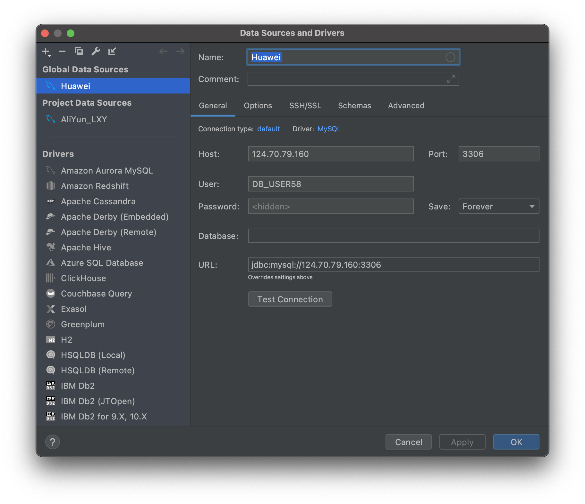

# 数据库系统实验报告

[TOC]

## 实验环境

* Windows 10 Pro 2004、macOS 11.0
* MySQL Workbench、DataGrip 2020.3

## 数据库连接

### 实验目的

* 掌握DAS连接GaussDB(for MySQL)数据库实例。

### 实验内容

* 通过华为云数据管理服务 (Data Admin Service，简称DAS) ，通过预先分配好的 IAM 子账号，来连接华为云 GaussDB(for MySQL) 数据库实例。
* 通过 DataGrip 公网连接 GaussDB(for MySQL) 数据库实例。
* 向服务器导入本地数据表。
* 修正数据类型。

### 实验步骤

1. 登录数据库
2. 导入数据表
3. 修正数据类型

* 实验过程略，仅展示结果。

## 数据查询与修改

### 实验目的

* 对前两个实验建立的LTE数据库关系表和视图进行各种类型的查询操作和修改操作，加深对SQL语言中DML的了解，掌握相关查询语句和数据修改语句的使用方法。

### 实验内容

1. 单表简单查询，包括复合选择条件、结果排序、结果去重、结果重命名查询；
2. 多表查询，包括等值连接、自然连接、元组变量查询；
3. 统计查询，包括带有分组、聚集函数的查询；
4. 嵌套查询，包括带有 in/some/all、exists、unique 的嵌套查询，from 中子查询；
5. with 临时视图查询；
6. 键/函数依赖分析；
7. 表的插入、删除、更新

### 实验步骤

#### 单表查询

##### 查询1

* 从小区/基站信息表tbCell表中，找出“sanxia”市满足下列条件的所有小区cell：

（1）所属基站的经纬度范围分别位于[？,？]、[？,？？]，并且

（2）PCI值在？至？之间，并且

（3）设备厂家VENDOR不为空

* 列出这些小区的小区标识（Sector_ID）、小区名、所属基站的基站ID和基站名、基站经纬度、小区PCI、小区天线的方位角(azimuth)和高度(height)；

* 要求：对查询结果，按照经度范围从大到小、纬度范围从大到小、频点(RARFCN)从高到低排序，并且将PCI重新命名为Physical Cell Identity。

* 说明：？代表由学生自己选择输入条件

 

##### 查询2：

* 从小区/基站信息表tbCell表中，找出“sanxia”市满足下列条件的所有基站ENodeB：

（1）所属基站的经纬度范围分别位于[？-？]、[？,？？]，

（2）属于该基站的小区中，至少有一个小区的PCI值在？至？之间

* 列出这些基站的基站ID和基站名、基站经纬度、基站类型(Style)、设备生产厂家(Vendor)；要求：对查询结果，按照基站位置从北到南、从东到西排序，并且对查询结果使用distinct去重。

* 比较对查询结果去重和不去重，在查询时间和查询结果上的差异。

 

#### String 操作

查询3：从小区/基站信息表tbCell表中，找出满足下列条件的小区：

（1）小区名开头部分包含“A池”或“高铁”，或者基站名中包含“医院”或“实验高中”，并且

（2） 不是所属基站的第1小区，即小区名结尾部分不是“-1”

 

查询4：从小区/基站信息表tbCell表中，找出满足下列条件的小区：

（1）小区标识由5个字符组成，并且

（2）小区所属基站的名字/标识至少包括8个字符，即名字字符串的长度不小于8。

 

#### 集合操作

查询5：使用集合并操作union、union all，从小区KPI指标表tbCellKPI查询满足下列条件的小区

(1)小区RRC建立成功率qf (%)大于95%，或者

(2)E-RAB建立成功率2 (%)大于99%

对比union all、union操作在查询结果、执行时间上的差异。

 

查询6：结合教材3.4.1节元组变量样例，使用集合操作except、except all，从小区/基站信息表tbCell表中，查询位于最北端（具有最大纬度）的基站。

对比使用except、except all、聚集函数max，完成此查询在执行时间、查询结果上的异同。

 

